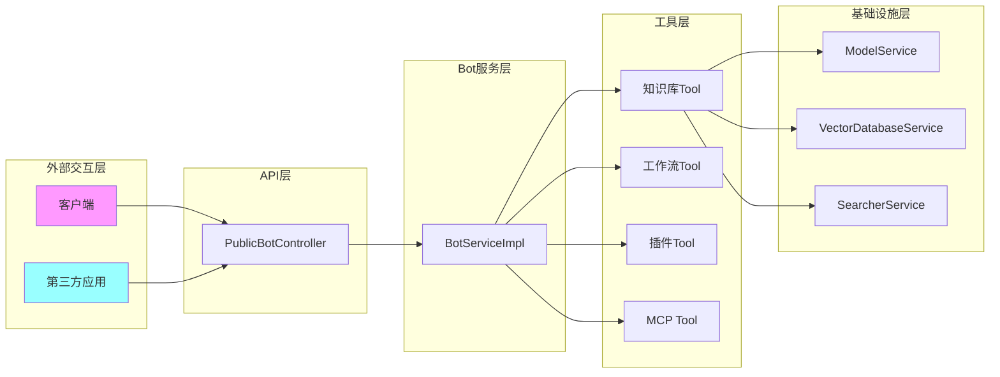
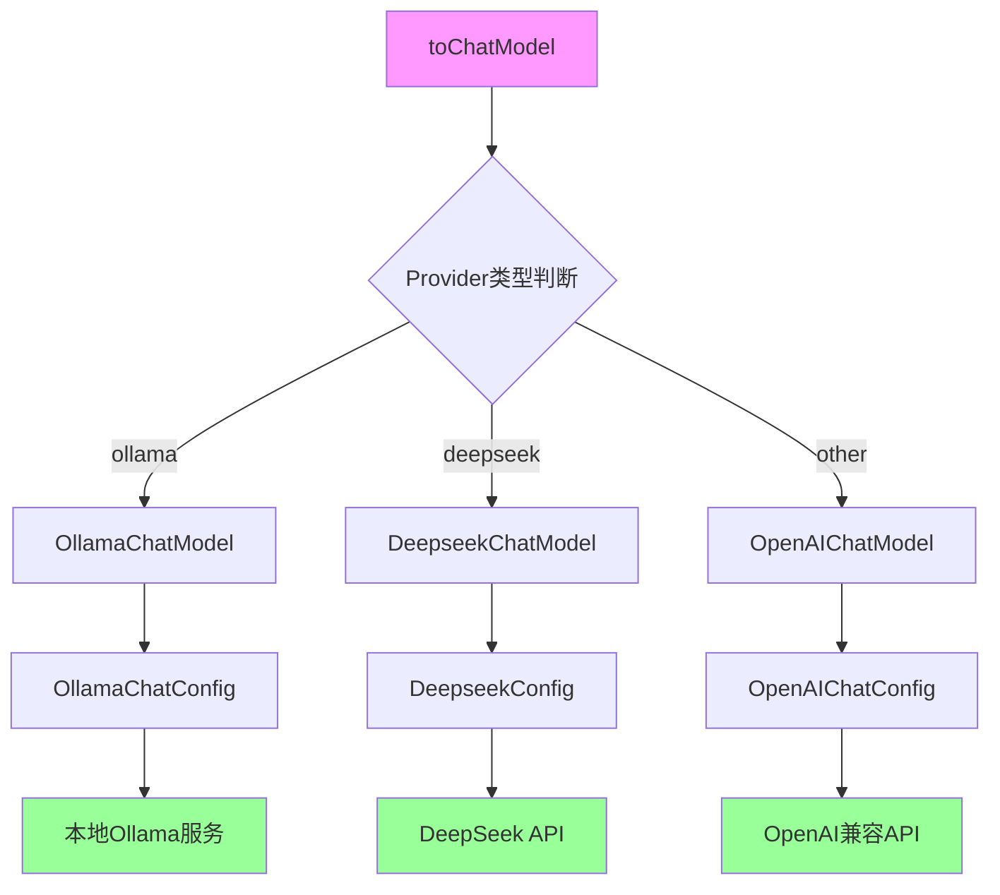
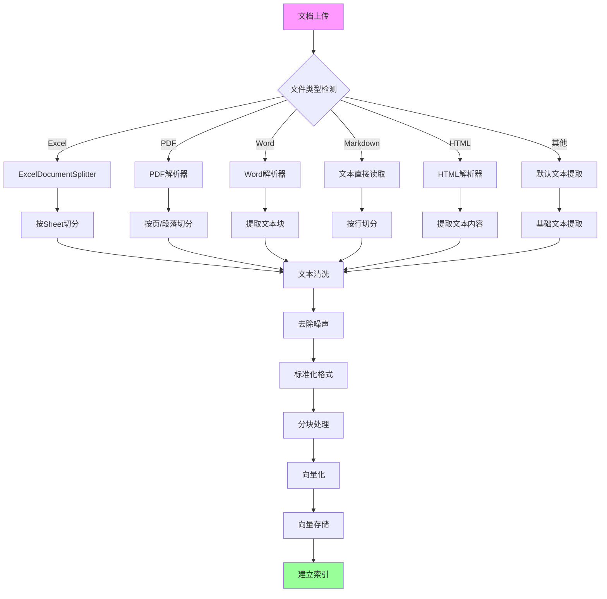
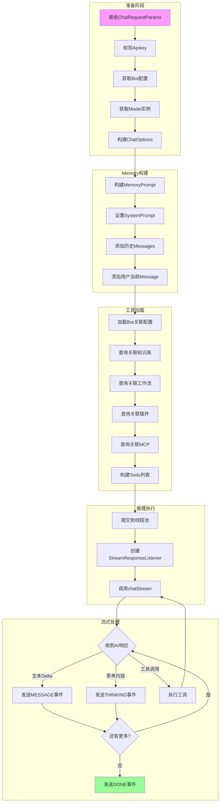
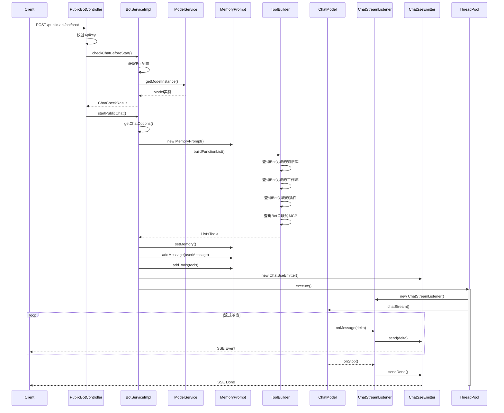
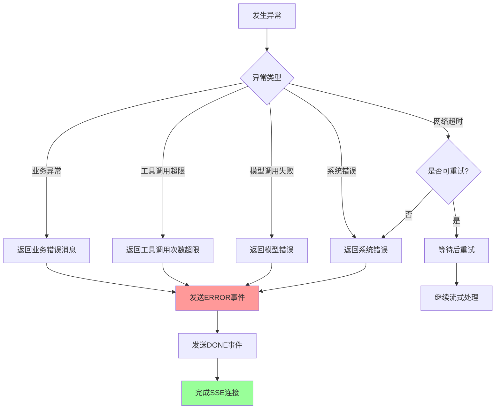

# AI模块深度分析

## 目录

1. [核心功能定义与边界划分](#1-核心功能定义与边界划分)
2. [算法选型依据与模型架构](#2-算法选型依据与模型架构)
3. [数据预处理与特征工程](#3-数据预处理与特征工程)
4. [模型训练推理完整链路](#4-模型训练推理完整链路)
5. [模块交互接口规范](#5-模块交互接口规范)
6. [性能优化策略](#6-性能优化策略)
7. [独立调用流程图](#7-独立调用流程图)

---

## 1. 核心功能定义与边界划分

### 1.1 功能模块职责表

| 功能模块 | 职责范围 | 核心类 | 边界接口 |
|---------|---------|--------|---------|
| **Bot管理** | Bot创建、配置、聊天会话管理、匿名访问控制 | `BotServiceImpl`, `BotConversationServiceImpl` | 对外提供聊天SSE接口 |
| **模型管理** | LLM/Embedding/Rerank模型配置、验证、实例化 | `ModelServiceImpl`, `ModelProviderServiceImpl` | 模型实例获取 |
| **知识库** | 文档上传、切分、向量化、混合检索、Rerank重排 | `DocumentCollectionServiceImpl`, `DocumentServiceImpl` | 知识检索Tool |
| **工作流** | 工作流编排、节点执行、结果存储 | `WorkflowServiceImpl`, `WorkflowExecResultServiceImpl` | 工作流执行Tool |
| **插件系统** | 外部工具接入、参数转换、HTTP调用 | `PluginServiceImpl`, `PluginItemServiceImpl` | 插件Tool |
| **MCP集成** | Model Context Protocol协议支持 | `McpServiceImpl`, `BotMcpServiceImpl` | MCP Tool |

### 1.2 模块边界划分图



---

## 2. 算法选型依据与模型架构

### 2.1 模型类型体系

```java
// Model.java:45
public final static String[] MODEL_TYPES = {"chatModel", "embeddingModel", "rerankModel"};
```

| 模型类型 | 核心功能 | 算法特点 | 典型应用场景 |
|---------|---------|---------|-------------|
| **chatModel** | 对话生成 | 自回归语言模型，支持Tool Call | 用户聊天、任务执行 |
| **embeddingModel** | 文本向量化 | 双塔模型，生成固定维度向量 | 语义检索、相似度计算 |
| **rerankModel** | 结果重排序 | 交叉编码器，计算相关性评分 | 提升检索结果相关性 |

### 2.2 模型架构细节

#### 2.2.1 ChatModel工厂模式实现



#### 2.2.2 核心代码实现

```java
// Model.java:56-91
public ChatModel toChatModel() {
    String providerType = modelProvider.getProviderType();
    switch (providerType.toLowerCase()) {
        case "ollama":
            OllamaChatConfig config = new OllamaChatConfig();
            config.setEndpoint(checkAndGetEndpoint());
            config.setApiKey(checkAndGetApiKey());
            config.setModel(checkAndGetModelName());
            config.setProvider(getModelProvider().getProviderName());
            return new OllamaChatModel(config);

        case "deepseek":
            DeepseekConfig config = new DeepseekConfig();
            config.setProvider(getModelProvider().getProviderName());
            config.setEndpoint(checkAndGetEndpoint());
            config.setApiKey(checkAndGetApiKey());
            config.setModel(checkAndGetModelName());
            config.setRequestPath(checkAndGetRequestPath());
            return new DeepseekChatModel(config);

        default: // OpenAI兼容
            OpenAIChatConfig config = new OpenAIChatConfig();
            config.setProvider(getModelProvider().getProviderName());
            config.setEndpoint(checkAndGetEndpoint());
            config.setApiKey(checkAndGetApiKey());
            config.setModel(checkAndGetModelName());
            config.setRequestPath(checkAndGetRequestPath());
            return new OpenAIChatModel(config);
    }
}
```

### 2.3 向量模型配置

```java
// Model.java:114-142
public EmbeddingModel toEmbeddingModel() {
    String providerType = modelProvider.getProviderType();
    switch (providerType.toLowerCase()) {
        case "ollama":
            OllamaEmbeddingConfig config = new OllamaEmbeddingConfig();
            config.setProvider(getModelProvider().getProviderName());
            config.setEndpoint(checkAndGetEndpoint());
            config.setModel(checkAndGetModelName());
            return new OllamaEmbeddingModel(config);

        default: // OpenAI兼容
            OpenAIEmbeddingConfig config = new OpenAIEmbeddingConfig();
            config.setProvider(getModelProvider().getProviderName());
            config.setEndpoint(checkAndGetEndpoint());
            config.setApiKey(checkAndGetApiKey());
            config.setModel(checkAndGetModelName());
            return new OpenAIEmbeddingModel(config);
    }
}
```

---

## 3. 数据预处理与特征工程

### 3.1 文档处理完整流程



### 3.2 知识库检索流程（混合检索策略）

```java
// DocumentCollectionServiceImpl.java:69-180
public List<Document> search(BigInteger id, String keyword) {
    // 1. 获取知识库配置
    DocumentCollection collection = getById(id);

    // 2. 初始化向量存储
    VectorDatabase vectorDb = vectorDatabaseService.getById(collection.getVectorDatabaseId());
    DocumentStore documentStore = vectorDb.toDocumentStore(collection.getVectorOtherConfig());

    // 3. 获取向量模型
    Model embedModel = modelService.getModelInstance(collection.getVectorEmbedModelId());
    documentStore.setEmbeddingModel(embedModel.toEmbeddingModel());

    // 4. 配置召回参数
    SearchWrapper wrapper = new SearchWrapper();
    wrapper.setMaxResults(docRecallMaxNum);  // 最大召回数
    wrapper.setMinScore(minMixedSimilarity); // 最低相似度
    wrapper.setText(keyword);

    // 5. 并行执行混合检索
    CompletableFuture<List<Document>> vectorFuture = CompletableFuture.supplyAsync(() ->
        documentStore.search(wrapper, options)
    );

    CompletableFuture<List<Document>> searcherFuture = CompletableFuture.supplyAsync(() -> {
        DocumentSearcher searcher = searcherFactory.getSearcher(searchEngineType);
        return searcher.searchDocuments(keyword, MAX_RECALL_DOC_NUM, metadataFilters);
    });

    // 6. 合并结果计算综合得分
    List<Document> documents = DocumentScoreCalculator.calculateTotalScore(
        vectorDocuments, searcherDocuments, vectorWeight, searcherWeight);

    // 7. Rerank重排（如配置）
    if (collection.getRerankModelId() != null) {
        RerankModel rerankModel = modelRerank.toRerankModel();
        documents = rerankModel.rerank(keyword, documents);
    }

    return processDocuments(documents, minSimilarity, maxResults);
}
```

### 3.3 检索参数配置表

| 参数Key | 作用 | 数据类型 | 默认值 |
|--------|------|---------|--------|
| `KEY_DOC_RECALL_MAX_NUM` | 最大召回文档数 | Integer | 10 |
| `KEY_MIXED_SIMILARITY_THRESHOLD` | 混合检索最低相似度 | Float | 0.7 |
| `KEY_VECTOR_WEIGHT` | 向量检索权重 | Double | 0.5 |
| `KEY_SEARCHER_WEIGHT` | 全文检索权重 | Double | 0.5 |
| `KEY_SEARCH_ENGINE_TYPE` | 搜索引擎类型 | String | lucene |
| `KEY_COLLECTION_NAME` | 向量库Collection | String | - |

---

## 4. 模型训练推理完整链路

### 4.1 聊天推理完整流程



### 4.2 核心推理代码

```java
// BotServiceImpl.java:220-244
@Override
public SseEmitter startPublicChat(BigInteger botId, String prompt,
    List<Message> messages, ChatCheckResult chatCheckResult) {

    // 1. 获取聊天配置
    Map<String, Object> modelOptions = chatCheckResult.getModelOptions();
    ChatOptions chatOptions = getChatOptions(modelOptions);
    ChatModel chatModel = chatCheckResult.getChatModel();

    // 2. 构建用户消息
    UserMessage userMessage = new UserMessage(prompt);

    // 3. 创建SSE发射器
    ChatSseEmitter chatSseEmitter = new ChatSseEmitter();
    SseEmitter emitter = chatSseEmitter.getEmitter();

    // 4. 构建Memory（使用Public版本，不持久化）
    ChatMemory defaultChatMemory = new PublicBotMessageMemory(chatSseEmitter, messages);

    // 5. 构建Prompt
    final MemoryPrompt memoryPrompt = new MemoryPrompt();
    memoryPrompt.setMemory(defaultChatMemory);
    memoryPrompt.addMessage(userMessage);

    // 6. 添加工具列表
    memoryPrompt.addTools(buildFunctionList(Maps.of("botId", botId)
        .set("needEnglishName", false)
        .set("needAccountId", false)));

    // 7. 异步执行推理
    threadPoolTaskExecutor.execute(() -> {
        StreamResponseListener listener = new ChatStreamListener(
            chatCheckResult.getConversationIdStr(),
            chatModel,
            memoryPrompt,
            chatSseEmitter,
            chatOptions);
        chatModel.chatStream(memoryPrompt, listener, chatOptions);
    });

    return emitter;
}
```

### 4.3 工具调用循环处理

```java
// ChatStreamListener.java:54-109
@Override
public void onMessage(StreamContext context, AiMessageResponse response) {
    if (maxToolCallCount.get() >= 20) {
        sendSystemError(sseEmitter, "工具调用次数超出限制");
        return;
    }

    AiMessage aiMessage = response.getMessage();
    if (aiMessage.isFinalDelta() && response.hasToolCalls()) {
        // 检测到工具调用
        this.canStop = false;
        this.hasToolCall = true;

        List<ToolCall> toolCalls = aiMessage.getToolCalls();
        memoryPrompt.addMessage(new AiMessage().setToolCalls(toolCalls));

        // 执行工具调用并获取结果
        List<ToolMessage> toolMessages = response.executeToolCallsAndGetToolMessages();
        for (ToolMessage toolMessage : toolMessages) {
            memoryPrompt.addMessage(toolMessage);
        }

        maxToolCallCount.incrementAndGet();
        chatModel.chatStream(memoryPrompt, this, chatOptions);

    } else {
        // 普通文本响应
        if (this.hasToolCall) {
            this.canStop = true;
        }

        String reasoningContent = aiMessage.getReasoningContent();
        if (reasoningContent != null && !reasoningContent.isEmpty()) {
            sendChatEnvelope(sseEmitter, reasoningContent, ChatType.THINKING);
        } else {
            String delta = aiMessage.getContent();
            if (delta != null && !delta.isEmpty()) {
                maxToolCallCount.set(0); // 重置计数
                sendChatEnvelope(sseEmitter, delta, ChatType.MESSAGE);
            }
        }
    }
}
```

---

## 5. 模块交互接口规范

### 5.1 聊天接口请求格式

**端点**: `POST /public-api/bot/chat`

**Headers**:
| Header | 类型 | 必填 | 说明 |
|--------|------|------|------|
| `Apikey` | String | 是 | API密钥 |
| `Content-Type` | String | 是 | `application/json` |

**请求体 (ChatRequestParams)**:
```json
{
  "botId": "123456789",
  "prompt": "用户输入的问题",
  "conversationId": "uuid格式的会话ID",
  "messages": [
    {
      "type": "user",
      "content": "历史消息1"
    },
    {
      "type": "assistant",
      "content": "历史回复1"
    }
  ],
  "attachments": ["fileUrl1", "fileUrl2"]
}
```

| 字段 | 类型 | 必填 | 说明 |
|-----|------|------|------|
| `botId` | String/BigInteger | 是 | Bot ID或别名 |
| `prompt` | String | 是 | 当前用户输入 |
| `conversationId` | String | 是 | 会话唯一标识 |
| `messages` | List | 否 | 历史消息列表 |
| `attachments` | List<String> | 否 | 附件URL列表 |

### 5.2 SSE响应格式

**响应类型**: `text/event-stream`

**事件格式**:
```
event: message
data: {"domain":"LLM","type":"MESSAGE","payload":{"conversation_id":"xxx","role":"assistant","delta":"内容"}}

event: thinking
data: {"domain":"LLM","type":"THINKING","payload":{"conversation_id":"xxx","role":"assistant","delta":"思考内容"}}

event: done
data: {"domain":"SYSTEM","type":"DONE","payload":{}}

event: error
data: {"domain":"SYSTEM","type":"ERROR","payload":{"code":"ERROR_CODE","message":"错误信息","retryable":false}}
```

### 5.3 错误码定义

| 错误码/场景 | 错误信息 | HTTP状态码 | 可重试 |
|-----------|---------|-----------|--------|
| `SYSTEM_ERROR` | 系统错误 | 200 | false |
| 业务异常 | Apikey不能为空 | 200 | false |
| 业务异常 | 提示词不能为空 | 200 | false |
| 业务异常 | conversationId不能为空 | 200 | false |
| 业务异常 | 聊天助手不存在 | 200 | false |
| 业务异常 | 请配置大模型 | 200 | false |
| 业务异常 | 模型不存在，请检查配置 | 200 | false |
| 业务异常 | 对话模型获取失败 | 200 | false |
| 业务异常 | 此聊天助手不支持匿名访问 | 200 | false |
| 业务异常 | 工具调用次数超出限制 | 200 | false |

---

## 6. 性能优化策略

### 6.1 线程池配置

```java
// ThreadPoolConfig.java:18-39
@Bean(name = "sseThreadPool")
public ThreadPoolTaskExecutor sseThreadPool() {
    ThreadPoolTaskExecutor executor = new ThreadPoolTaskExecutor();
    int cpuCoreNum = Runtime.getRuntime().availableProcessors();

    // 核心线程数 = CPU核心 * 2（IO密集型优化）
    executor.setCorePoolSize(cpuCoreNum * 2);

    // 最大线程数 = CPU核心 * 10（峰值扩容）
    executor.setMaxPoolSize(cpuCoreNum * 10);

    // 队列容量 8000（缓冲高峰请求）
    executor.setQueueCapacity(8000);

    // 空闲线程存活时间 30秒
    executor.setKeepAliveSeconds(30);

    executor.setThreadNamePrefix("sse-sender-");

    // 拒绝策略：抛出业务异常
    executor.setRejectedExecutionHandler((runnable, executorService) -> {
        log.error("SSE线程池过载！...");
        throw new BusinessException("服务器忙，请稍后重试");
    });

    executor.initialize();
    return executor;
}
```

**配置参数说明**:

| 参数 | 配置值 | 说明 |
|-----|-------|------|
| `corePoolSize` | CPU核心 × 2 | 正常负载下的线程数 |
| `maxPoolSize` | CPU核心 × 10 | 峰值负载时的最大线程数 |
| `queueCapacity` | 8000 | 任务队列缓冲容量 |
| `keepAliveSeconds` | 30 | 非核心线程空闲存活时间 |

### 6.2 缓存机制

**配置来源**: `application.yml:98-121`

```yaml
jetcache:
  cacheType: local  # 本地缓存优先
  statIntervalMinutes: 15  # 统计间隔
  local:
    default:
      type: linkedhashmap  # LRU本地缓存
      keyConvertor: fastjson
  remote:
    default:
      type: redis
      host: 127.0.0.1
      port: 6379
      poolConfig:
        maxTotal: 50  # 最大连接数
```

### 6.3 并行检索优化

```java
// DocumentCollectionServiceImpl.java:105-118
// 使用CompletableFuture实现并行检索
CompletableFuture<List<Document>> vectorFuture = CompletableFuture.supplyAsync(() ->
    documentStore.search(wrapper, options)  // 向量检索
);

CompletableFuture<List<Document>> searcherFuture = CompletableFuture.supplyAsync(() -> {
    DocumentSearcher searcher = searcherFactory.getSearcher(searchEngineType);
    return searcher.searchDocuments(keyword, MAX_RECALL_DOC_NUM, metadataFilters);  // 全文检索
});

// 等待所有任务完成
CompletableFuture<Void> combinedFuture = CompletableFuture.allOf(vectorFuture, searcherFuture);
combinedFuture.get();

// 合并结果
List<Document> vectorDocuments = vectorFuture.get();
List<Document> searcherDocuments = searcherFuture.get();
```

### 6.4 工具调用次数限制

```java
// ChatStreamListener.java:38,56-58
private final AtomicInteger maxToolCallCount = new AtomicInteger(0);

// 在onMessage中检查
if (maxToolCallCount.get() >= 20) {
    sendSystemError(sseEmitter, "工具调用次数超出限制，请重新开始会话。");
    return;
}
```

---

## 7. 独立调用流程图

### 7.1 AI模块完整调用时序图



### 7.2 各环节输入输出参数表

| 环节 | 输入参数 | 输出参数 | 数据类型 |
|-----|---------|---------|---------|
| **Apikey校验** | `apikey: String`, `requestURI: String` | void/异常 | Headers |
| **Bot获取** | `botId: BigInteger` | `aiBot: Bot` | Entity |
| **Model实例化** | `modelId: BigInteger` | `chatModel: ChatModel` | agentsflex |
| **参数校验** | `prompt: String`, `conversationId: String` | void/异常 | String |
| **匿名访问校验** | `aiBot: Bot`, `loginStatus: boolean` | void/异常 | - |
| **构建ChatOptions** | `modelOptions: Map<String,Object>` | `chatOptions: ChatOptions` | agentsflex |
| **构建MemoryPrompt** | `systemPrompt: String`, `messages: List` | `memoryPrompt: MemoryPrompt` | agentsflex |
| **工具列表构建** | `botId: BigInteger` | `tools: List<Tool>` | agentsflex |
| **异步推理提交** | `memoryPrompt`, `chatModel`, `listener` | `SseEmitter` | Spring |
| **流式响应发送** | `delta: String`, `type: ChatType` | SSE Event | Server-Sent Events |

### 7.3 异常处理机制



### 7.4 耗时指标说明

| 处理阶段 | 预期耗时 | 说明 |
|---------|---------|------|
| Apikey校验 | <10ms | 本地缓存校验 |
| Bot配置获取 | <50ms | 数据库查询 |
| Model实例化 | <100ms | 首次创建，后续复用 |
| 工具列表构建 | <200ms | 涉及多次DB查询 |
| 异步推理提交 | <50ms | 线程池提交 |
| AI推理首Token | 取决于模型 | 通常200ms-2s |
| 流式响应延迟 | <50ms | SSE推送延迟 |

---

## 附录

### A. 向量数据库支持列表

| 数据库 | 类型标识 | 配置项 |
|-------|---------|--------|
| Redis | `redis` | host, port, username, password |
| Milvus | `milvus` | host, port, username, password, agreement |
| OpenSearch | `opensearch` | host, port, username, password, agreement |
| ElasticSearch | `elasticsearch` | host, port, username, password, agreement |
| 阿里云向量检索 | `aliyun` | apiKey, endpoint |
| 腾讯云向量检索 | `qcloud` | account, apiKey |

### B. 搜索引擎支持

| 搜索引擎 | 配置Key | 说明 |
|---------|--------|------|
| Lucene | `lucene` | 本地全文检索 |
| ElasticSearch | `elasticSearch` | 分布式全文检索 |

---

*返回 [文档首页](./README.md)* | *返回 [项目结构分析](./project-structure.md)*
