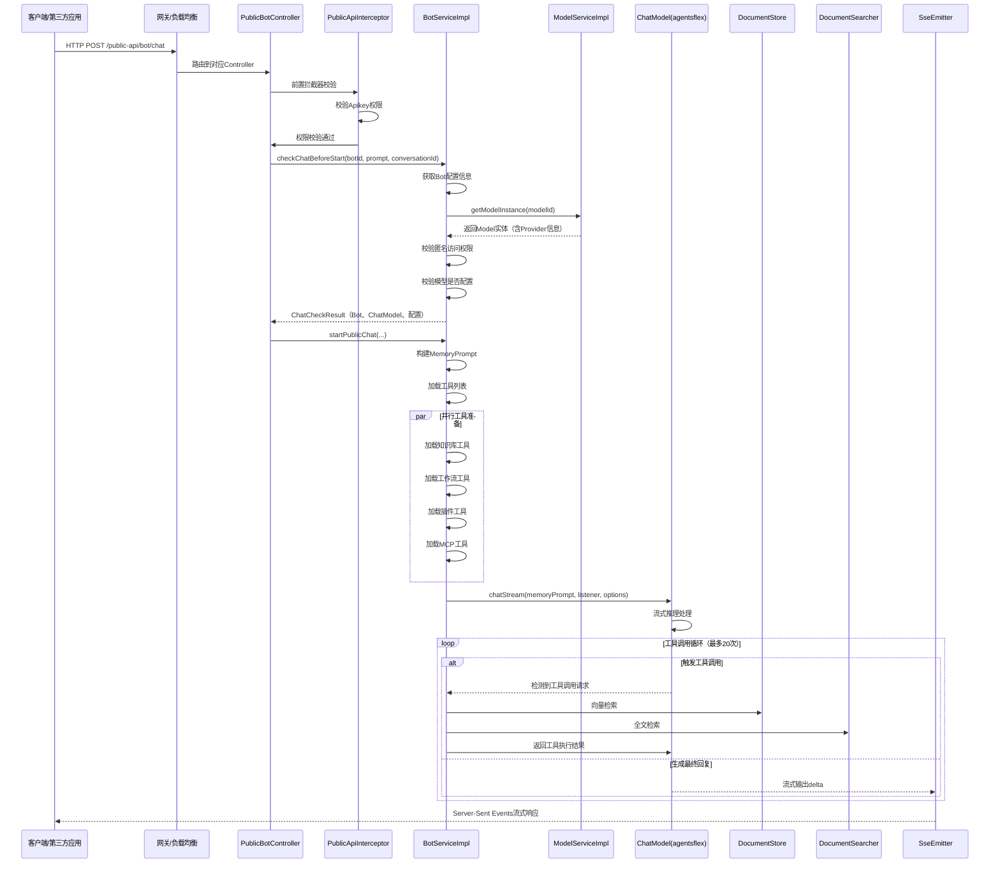
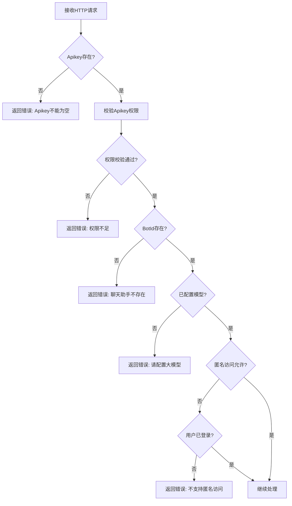
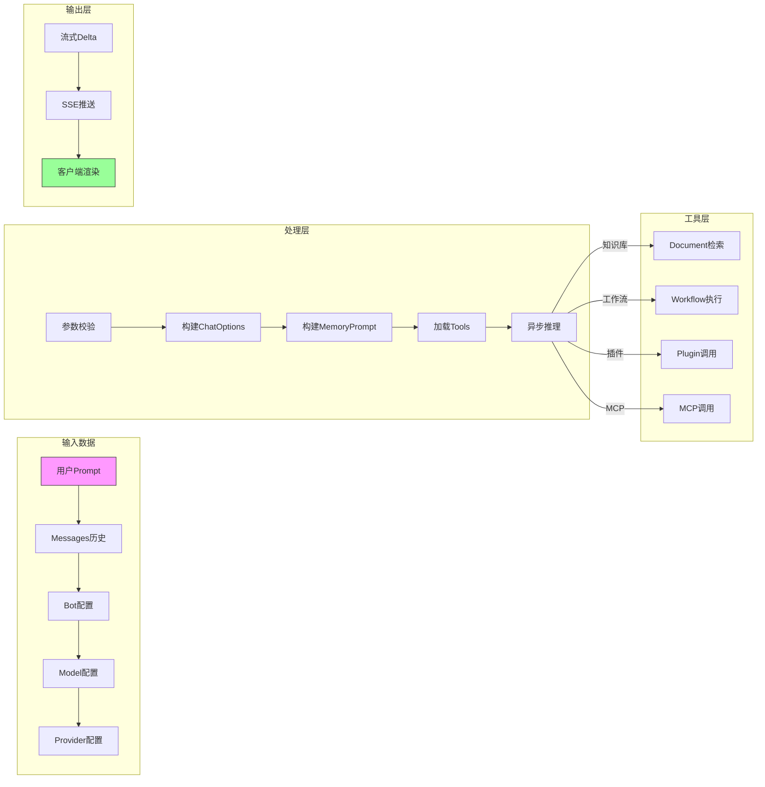
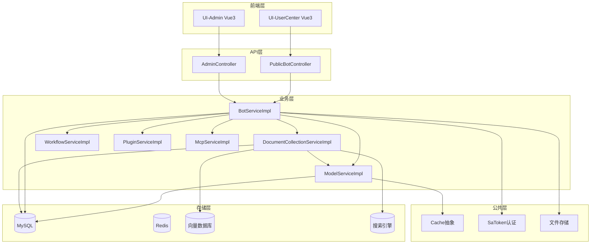
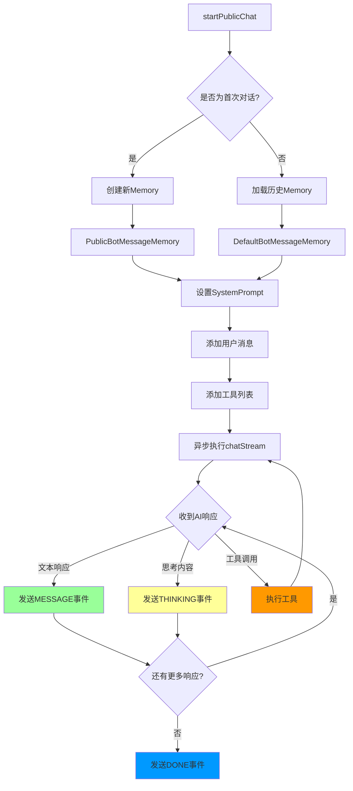
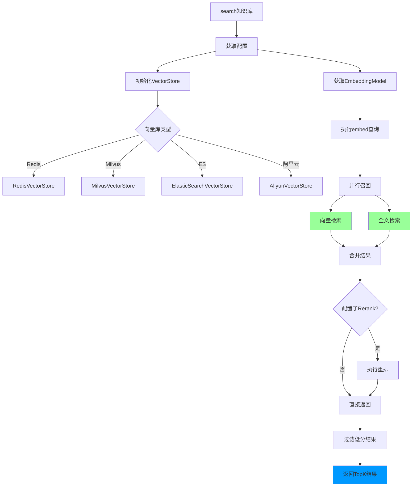
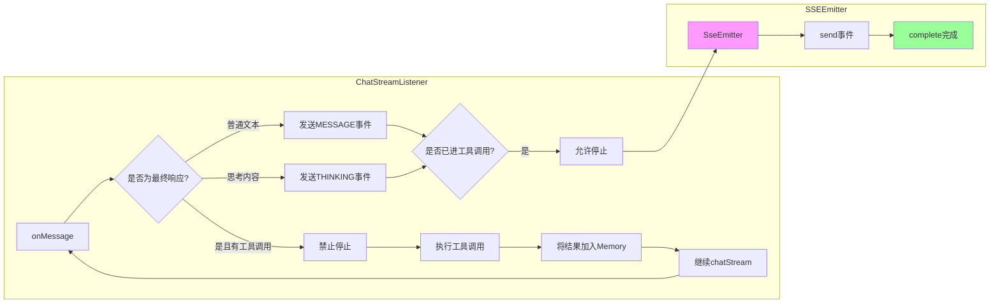

# 项目整体结构分析

## 1. 目录组织架构

```
aiflowy/
├── aiflowy-api/                    # API层（对外暴露接口）
│   ├── aiflowy-api-admin/          # 管理后台API
│   ├── aiflowy-api-mcp/            # MCP（Model Context Protocol）接口
│   ├── aiflowy-api-public/         # 公共API（第三方接入）
│   └── aiflowy-api-usercenter/     # 用户中心API
├── aiflowy-commons/                # 公共模块（可复用组件）
│   ├── aiflowy-common-ai/          # AI相关工具类
│   ├── aiflowy-common-all/         # 全量公共组件
│   ├── aiflowy-common-audio/       # 音频处理
│   ├── aiflowy-common-base/        # 基础工具
│   ├── aiflowy-common-cache/        # 缓存抽象
│   ├── aiflowy-common-captcha/      # 验证码
│   ├── aiflowy-common-satoken/      # 权限认证工具
│   └── aiflowy-common-web/         # Web通用组件
├── aiflowy-modules/                # 业务模块（核心业务逻辑）
│   ├── aiflowy-module-ai/           # AI核心模块（BOT、模型、知识库）
│   ├── aiflowy-module-auth/         # 认证模块
│   ├── aiflowy-module-system/       # 系统管理
│   ├── aiflowy-module-datacenter/   # 数据中心
│   ├── aiflowy-module-job/          # 定时任务
│   └── aiflowy-module-log/           # 日志模块
├── aiflowy-starter/                # 启动器（Spring Boot自动配置）
│   ├── aiflowy-starter-admin/       # 管理后台启动器
│   ├── aiflowy-starter-all/          # 全量启动器
│   ├── aiflowy-starter-codegen/      # 代码生成器
│   └── aiflowy-starter-public/      # 公共启动器
└── aiflowy-ui-admin/               # 前端管理后台（Vue 3）
    └── aiflowy-ui-usercenter/      # 前端用户中心
```

## 2. 模块职责划分

| 模块层级 | 模块名称 | 核心职责 | 关键类 |
|---------|---------|---------|--------|
| **API层** | `aiflowy-api-public` | 第三方API接入、Apikey认证 | `PublicBotController`, `PublicWorkflowController` |
| **API层** | `aiflowy-api-admin` | 管理后台API接口 | - |
| **API层** | `aiflowy-api-usercenter` | 用户中心API | - |
| **公共层** | `aiflowy-common-ai` | AI工具类、拦截器、文档处理 | `ChatSseEmitter`, `ToolLoggingInterceptor` |
| **公共层** | `aiflowy-common-cache` | 缓存配置与抽象 | - |
| **公共层** | `aiflowy-common-satoken` | SaToken权限认证封装 | `SaTokenUtil` |
| **业务层** | `aiflowy-module-ai` | AI核心业务逻辑 | `BotServiceImpl`, `ModelServiceImpl`, `DocumentCollectionServiceImpl` |
| **业务层** | `aiflowy-module-auth` | 用户认证与权限 | - |
| **业务层** | `aiflowy-module-system` | 系统配置管理 | - |
| **启动层** | `aiflowy-starter-all` | 应用启动入口 | `application.yml` |

## 3. 核心调用链路

### 3.1 整体请求处理流程



### 3.2 请求验证流程



### 3.3 数据流转过程



## 4. 关键模块依赖关系



## 5. 核心业务逻辑分支

### 5.1 聊天请求处理分支



### 5.2 知识库检索分支



## 6. 响应生成与输出

### 6.1 SSE响应格式

```json
// 文本消息事件
{
  "domain": "LLM",
  "type": "MESSAGE",
  "payload": {
    "conversation_id": "uuid-string",
    "role": "assistant",
    "delta": "这是AI的回复内容..."
  }
}

// 思考内容事件
{
  "domain": "LLM",
  "type": "THINKING",
  "payload": {
    "conversation_id": "uuid-string",
    "role": "assistant",
    "delta": "正在思考..."
  }
}

// 错误事件
{
  "domain": "SYSTEM",
  "type": "ERROR",
  "payload": {
    "code": "SYSTEM_ERROR",
    "message": "错误描述",
    "retryable": false
  }
}

// 结束事件
{
  "domain": "SYSTEM",
  "type": "DONE",
  "payload": {}
}
```

### 6.2 响应处理流程



## 7. 文件类型分类标准

| 文件类型 | 存放目录 | 说明 |
|---------|---------|------|
| Controller | `aiflowy-api-*/controller/` | 处理外部请求 |
| Service接口 | `aiflowy-module-*/service/` | 业务接口定义 |
| Service实现 | `aiflowy-module-*/service/impl/` | 业务逻辑实现 |
| Entity实体 | `aiflowy-module-*/entity/` | 数据模型 |
| Mapper | `aiflowy-module-*/mapper/` | 数据库映射 |
| 配置类 | `aiflowy-module-*/config/` | Spring配置 |
| 监听器 | `*-ai/agentsflex/listener/` | 事件监听处理 |
| 工具类 | `aiflowy-common-*/` | 公共工具 |

---

*返回 [文档首页](./README.md)*
